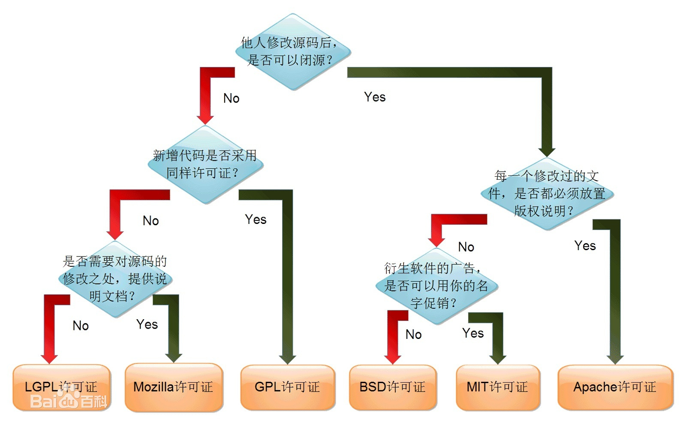

### 1、DMA+空闲中断方式 进行串口收发

定长数据的收发、不定长数据的收发、优点

### 2、程序中的状态机思想

超声波例子的状态机思想

```c
/**
 @brief ultrasonic sonar module heartbeat.
 @param None.
 @return None.
            ___                                                         ___
 TRIG   ___|   |_______________________________________________________|   |____
            >10us _   _   _   _   _   _   _   _          at least 10ms wait
 SENSOR _________| |_| |_| |_| |_| |_| |_| |_| |________________________________
                      Send 8 40KHz wave
                                                   ________
 ECHO   __________________________________________|        |____________________
                                                  10us ~ 18ms
 */
void sonar_heartbeat(void)
{
    if (g_sonar_ch >= _countof(g_sonar_cfg))
    {
        g_sonar_ch = 0;
        g_sonar[g_sonar_ch].state = SONAR_INIT;
    }

    switch (g_sonar[g_sonar_ch].state)
    {
    case SONAR_INIT:
        sonar_trigger(g_sonar_ch);
        g_sonar[g_sonar_ch].state++; /* Move to next state. */
        g_sonar[g_sonar_ch].ticks = getms();
        break;
    case SONAR_MEASURE: /* Wait until measurement done. */
        if (getms() - g_sonar[g_sonar_ch].ticks > CONFIG_SONAR_TIMEOUT_MS)
        {
            /* Timeout. Abort measurement and move to next channel. */
            //			_SONAR = -1;
            TIM_Cmd(SONAR_TIMER, DISABLE);
            sonar_shutdown(g_sonar_ch);
            g_sonar[g_sonar_ch].ticks = getms();
            g_sonar[g_sonar_ch].state = SONAR_IDLE;
            memset(g_sonar[g_sonar_ch].sample, 0, sizeof(g_sonar[g_sonar_ch].sample));
            g_sonar_ch++;
            if (g_sonar_ch >= _countof(g_sonar_cfg))
            {
                g_sonar_ch = 0;
            }
            //            drv_led_set(0, 0, 0);
        }
        break;
    case SONAR_DONE: /* Measurement is done. */
        if (g_sonar[g_sonar_ch].cnt == 0)
        {
            break;
        }
        if (g_sonar[g_sonar_ch].cnt >= CONFIG_SONAR_SAMPLE_SIZE)
        {
            g_sonar[g_sonar_ch].cnt = CONFIG_SONAR_SAMPLE_SIZE;
        }
        //        printf("sonar distance: %.4f", sonar_distance(g_sonar_ch));
        g_sonar[g_sonar_ch].state++;
        /* Blink the led by channel. */
        //        drv_led_set((g_sonar_ch%3)==0?1:0, (g_sonar_ch%3)==1?1:0, (g_sonar_ch%3)==2?1:0);
        //        sonar_dbg("ch %d, distance %d\r\n", g_sonar_ch, g_sonar[g_sonar_ch].distance);
        break;
    case SONAR_EXIT: /* Channel measurement is done. Move to next. */
        sonar_shutdown(g_sonar_ch);
        g_sonar[g_sonar_ch].ticks = getms();
        g_sonar[g_sonar_ch].state = SONAR_IDLE;
        g_sonar_ch++;
        if (g_sonar_ch >= _countof(g_sonar_cfg))
        {
            g_sonar_ch = 0;
        }
        break;
    default:
        if (getms() - g_sonar[g_sonar_ch].ticks < CONFIG_SONAR_TICKS)
        {
            break;
        }
        g_sonar[g_sonar_ch].state = SONAR_INIT;
        break;
    }

    return;
}
```


### 3、VSCODE介绍

VSCODE使用方法、安装教程

### 4、GIT的使用

GIT 的由来： linus --linux --git

### 5、GITHUB使用

国内访问github的方法

[https://yltzdhbc.gitee.io/](https://yltzdhbc.gitee.io/)

创建账号、新建仓库、下载程序、使用WINDOWS TERMIAL下载

### 6、MD文件的使用

使用MARKDOWN写readme.md、写博客

### 7、开源软件、开源协议

几种开源协议的对比、选择和声明



### 8、嵌入式领域

|          |     51     |                            stm32                             |                         嵌入式 Linux                         |
| :------: | :--------: | :----------------------------------------------------------: | :----------------------------------------------------------: |
|   内核   |  C51内核   |                     ARM Crotex M0/M3/M4                      |                    ARM Crotex A8/9/A72...                    |
| 编程方式 |  keil_C51  |                         Ide/makefile                         |                           makefile                           |
|   特点   | 操作寄存器 |                             使用                             |                      linux驱动+上层软件                      |
|   功能   |   低性能   | 中高性能控制，一般驱动层和程序放在一起，使用裸机或者rtos写上层应用 | 编写驱动编译内核为上层提供接口函数、在linux操作系统下下开发通用上层应用 |

