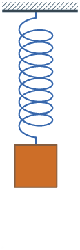

### 1、PID 、闭环、平衡小车

#### 1.1 PID算法的原理

**PID**已经有105年的历史了。

需要将某一个物理量“保持稳定”的场合（比如维持平衡，稳定温度、转速等），**PID**都会派上大用场。

比如，我想控制一个“热得快”，让一锅水的温度保持在50℃ 。

1. 小于50度就让它加热，大于50度就断电，不就行了？几行代码用Arduino分分钟写出来。

在要求不高的情况下，确实可以这么干

但是在大多数场合中，用“开关量”来控制一个物理量，就显得比较简单粗暴了。有时候，是无法保持稳定的。因为单片机、传感器不是无限快的，采集、控制需要时间。

而且，控制对象具有惯性。比如你将一个加热器拔掉，它的“余热”（即热惯性）可能还会使水温继续升高一小会。

这时，就需要一种『算法』：

- 它可以将需要控制的物理量带到目标附近
- 它可以“预见”这个量的变化趋势
- 它也可以消除因为散热、阻力等因素造成的静态误差
- ....

于是，当时的数学家们发明了这一历久不衰的算法——这就是PID。

你应该已经知道了，**P，I，D**是三种不同的调节作用，既可以单独使用**（P，I，D）**，也可以两个两个用**（PI，PD）**，也可以三个一起用**（PID）**。

这三种作用有什么区别呢？


**1、P**

**P**就是比例的意思。它的作用最明显，原理也最简单。我们先说这个：
需要控制的量，比如水温，有它现在的『当前值』，也有我们期望的『目标值』。

当两者差距不大时，就让加热器“轻轻地”加热一下。要是因为某些原因，温度降低了很多，就让加热器“稍稍用力”加热一下。

要是当前温度比目标温度低得多，就让加热器“开足马力”加热，尽快让水温到达目标附近。

这就是**P**的作用，跟开关控制方法相比，是不是“温文尔雅”了很多

实际写程序时，就让偏差（目标减去当前）与调节装置的“调节力度”，建立一个一次函数的关系，就可以实现最基本的“比例”控制了~
**K** **P**越大，调节作用越激进，**K** **P**调小会让调节作用更保守。

要是你正在制作一个平衡车，有了**K** **P**的作用，你会发现，平衡车在平衡角度附近来回“狂抖”，比较难稳住。

如果已经到了这一步——恭喜你！离成功只差一小步了~

**2、D**

**D**的作用更好理解一些，所以先说说**D**，最后说**i**。
刚才我们有了**P**的作用。你不难发现，只有**P**好像不能让平衡车站起来，水温也控制得晃晃悠悠，好像整个系统不是特别稳定，总是在“抖动”。

 

你心里设想一个弹簧：现在在平衡位置上。拉它一下，然后松手。这时它会震荡起来。因为阻力很小，它可能会震荡很长时间，才会重新停在平衡位置。

请想象一下：要是把上图所示的系统浸没在水里，同样拉它一下 ：这种情况下，重新停在平衡位置的时间就短得多。

我们需要一个控制作用，让被控制的物理量的“变化速度”趋于0，即类似于“阻尼”的作用。

因为，当比较接近目标时，**P**的控制作用就比较小了。越接近目标，**P**的作用越温柔。有很多内在的或者外部的因素，使控制量发生小范围的摆动。**D**的作用就是让物理量的速度趋于0，

只要什么时候，这个量具有了速度，**D**就向相反的方向用力，尽力刹住这个变化。

**kD**参数越大，向速度相反方向刹车的力道就越强。

如果是平衡小车，加上**P和D**两种控制作用，如果参数调节合适，它应该可以站起来了~欢呼吧

等等，**PID**三兄弟好想还有一位。看起来**PD**就可以让物理量保持稳定，那还要**I**干嘛？

因为我们忽视了一种重要的情况：

**3、i**

还是以热水为例。假如有个人把我们的加热装置带到了非常冷的地方，开始烧水了。需要烧到50℃。

在P的作用下，水温慢慢升高。直到升高到45℃时，他发现了一个不好的事情：天气太冷，水散热的速度，和P控制的加热的速度相等了。
这可怎么办？

- P兄这样想：我和目标已经很近了，只需要轻轻加热就可以了。
- D兄这样想：加热和散热相等，温度没有波动，我好像不用调整什么。
  于是，水温永远地停留在45℃，永远到不了50℃。

作为一个人，根据常识，我们知道，应该进一步增加加热的功率。可是增加多少该如何计算呢？

前辈科学家们想到的方法是真的巧妙。

设置一个积分量。只要偏差存在，就不断地对偏差进行积分（累加），并反应在调节力度上。

这样一来，即使45℃和50℃相差不太大，但是随着时间的推移，只要没达到目标温度，这个积分量就不断增加。

系统就会慢慢意识到：还没有到达目标温度，该增加功率啦！

到了目标温度后，假设温度没有波动，积分值就不会再变动。这时，加热功率仍然等于散热功率。但是，温度是稳稳的50℃。

**Ki**的值越大，积分时乘的系数就越大，积分效果越明显。

所以，**I**的作用就是，减小静态情况下的误差，让受控物理量尽可能接近目标值。

I在使用时还有个问题：需要设定积分限制。防止在刚开始加热时，就把积分量积得太大，难以控制。

这篇就写到这里。要想直观地体验**PID**的控制作用，需要一个具体的东西来调试

[本文参考链接](https://mp.weixin.qq.com/s?__biz=MzA4NTU3MjQ0OA==&mid=2247486604&idx=1&sn=0e7dd1cc7bdef8aaa3e0f129d8a18417&chksm=9fd4a283a8a32b95444c98edb6b3c83bd470e906f801c5dfd990066d3148e9c2160ae99f3485&scene=21#wechat_redirect)


*** 推荐一篇文章 ***

[由入门到精通吃透PID](/doc)

#### 1.2 电机闭环中使用的PID

简介... 闭环驱动的程序代码

#### 平衡小车使用PID进行平衡

讲解程序

```c

      // 电机脉冲控制器. input: 每个电机的目标脉冲数. output: 电机速度
      motor1_control = positionPDControl(steps1, target_steps1, Kp_position, Kd_position, speed_M1);
      motor2_control = positionPDControl(steps2, target_steps2, Kp_position, Kd_position, speed_M2);

      // 将电机脉冲控制的输出量转换为油门和转向数据
      throttle = (motor1_control + motor2_control) / 2;
      throttle = constrain(throttle, -190, 190);
      steering = motor2_control - motor1_control;
      steering = constrain(steering, -50, 50);


    // 机器人速度控制器 PI
    // input:设定的速度数据(油门,转向), variable: 估算的反馈速度, output: 目标机器人倾角(改变倾角获得期望速度)
    target_angle = speedPIControl(dt, estimated_speed_filtered, throttle, Kp_thr, Ki_thr);
    target_angle = constrain(target_angle, -max_target_angle, max_target_angle);

#if DEBUG == 3
    Serial.print(angle_adjusted);
    Serial.print(" ");
    Serial.print(estimated_speed_filtered);
    Serial.print(" ");
    Serial.println(target_angle);
    Serial.print(" ");
    Serial.println(BatteryValue);
#endif

    // 机器人稳定控制器 (100Hz loop) PD
    // input: 机器人的目标角度(由速度控制器传入), variable: 机器人反馈回来的真实角度, output: 电机速度
    // We integrate the output (sumatory), so the output is really the motor acceleration, not motor speed.
    control_output += stabilityPDControl(dt, angle_adjusted, target_angle, Kp, Kd);
    control_output = constrain(control_output, -MAX_CONTROL_OUTPUT, MAX_CONTROL_OUTPUT);

    motor1 = control_output + steering;
    motor2 = control_output - steering;

```

[讲的比较详细的文章链接](https://mp.weixin.qq.com/s?__biz=MzA4NTU3MjQ0OA==&mid=2247486648&idx=1&sn=181d45a2d1b59df57e886a8a31a77919&chksm=9fd4a2b7a8a32ba13cdce75d53f5ce981ebc17911557acf3195c109b60d4a70d9a0798547151&scene=126&sessionid=1585318983&key=71aa023f7dc44adc41e061c59d712120810bee6444753905d4cc6fca47b20c89c6d74b88955507ce9d491a044e2e9c7a41354f9acc88821c281e95e11fb8f8bf3cb11eecc19cfdeb7f4ba9656f5eb453&ascene=1&uin=MjAxMDUxNDY4Mw%3D%3D&devicetype=Windows+10&version=62080079&lang=zh_CN&exportkey=AdP4f5%2BeaWguUnpcJs7b3hU%3D&pass_ticket=PVqKXMJnRspfUAnuYf6c6G5LZhByDBXiprnDVW7e6%2FJ4YA8p7iHzGkRvf14FuPd2)

### 2、KEIL简单的调试用法

查看变量 查看地址 断点 步进

推荐文章

https://blog.csdn.net/yuleitao/article/details/103322764

### 3、立创EDA介绍、画板初步

注册账号 CH340 转接板 演示

链接 https://lceda.cn/